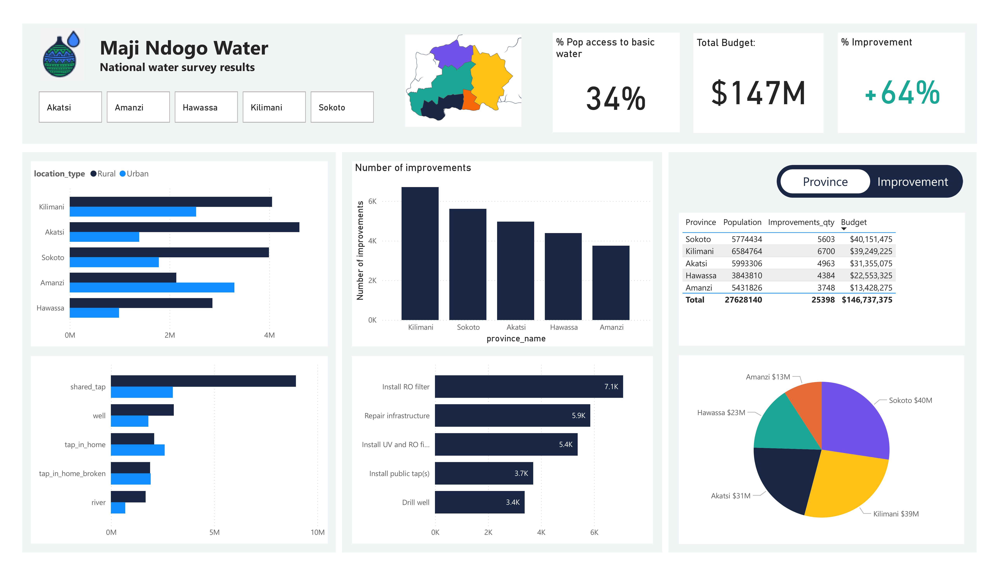
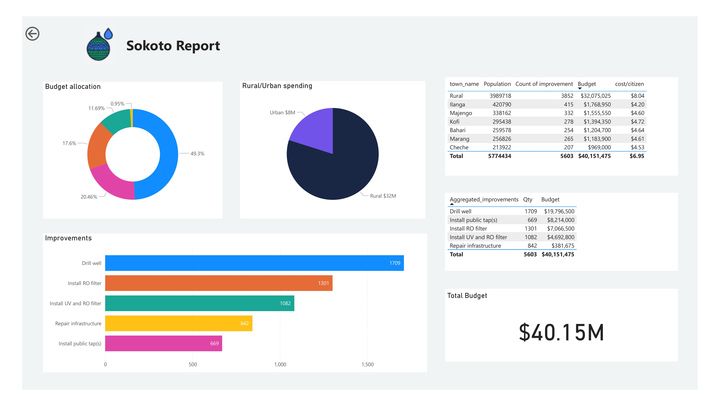
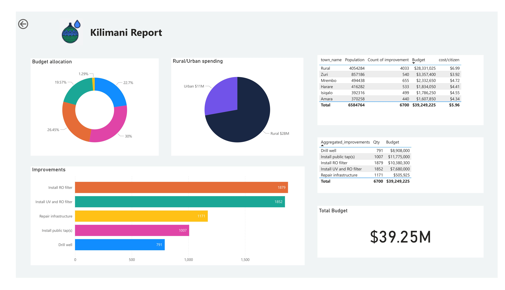
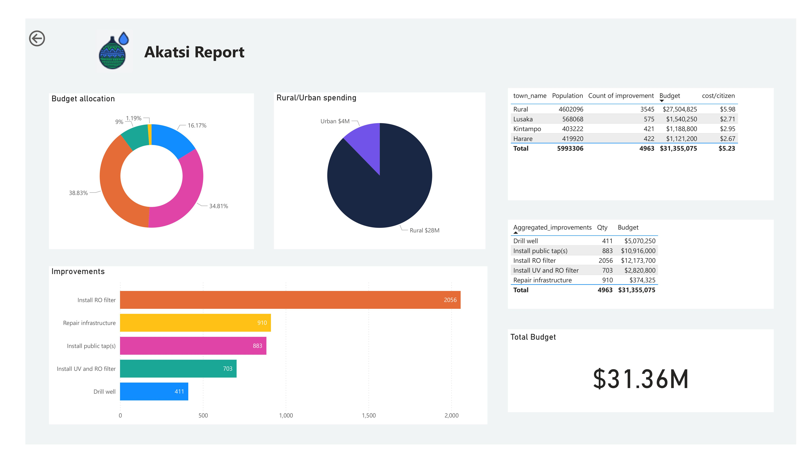
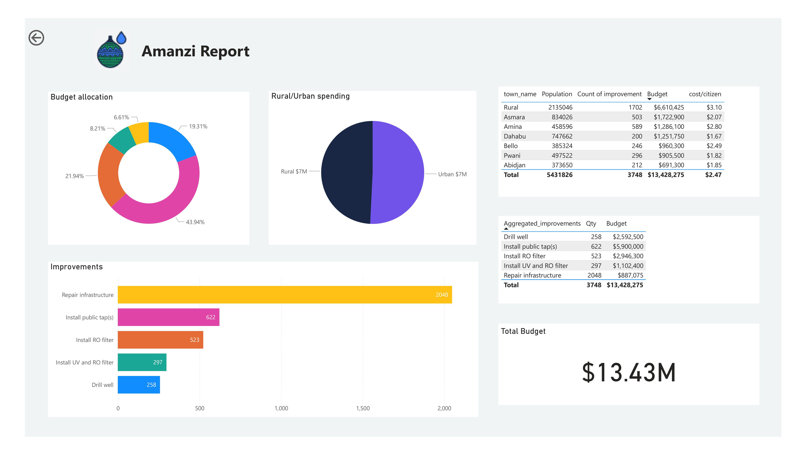
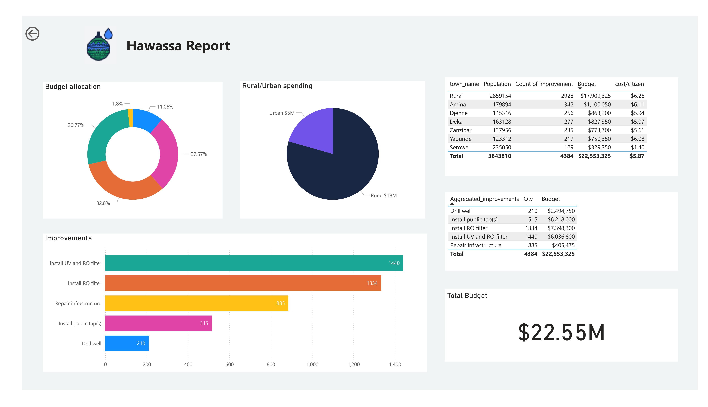

# National Water Survey Results & Improvement Project

## Overview
This project focuses on analyzing and visualizing water access data in Maji Ndogo to support decision-makers in addressing the national water crisis. The goal is to provide clear, actionable insights into water access challenges, necessary upgrades, and budget allocations at both national and provincial levels. The report aims to facilitate data-driven decisions to solve the water crisis and improve the lives of people in Maji Ndogo.

## Problem Statement
President Aziza Naledi requested a report to clarify the national and provincial status of water access, as she was struggling to understand how previous information fit together. Specifically, she needed to understand:
*   How people are currently obtaining water.
*   The number of people in Maji Ndogo without basic water access.
*   The total capital required for upgrades and how these funds should be spent.
*   Data presented at both national and provincial levels to empower local leaders in their decision-making.

The project team focused on creating a report that would help visualize this data to get projects started.

## User Stories
The report was designed with two primary user stories in mind to ensure relevance and usability for decision-makers:

### As Aziza (President Naledi), I want to:
1.  **Understand the overall status of water access**: See key points of the survey results to grasp the national situation.
2.  **Identify water access challenges**: Know how many people are affected and the nature of these challenges.
3.  **Grasp financial requirements**: Understand the total budget needed for upgrades and how the money will be allocated.
4.  **View data at national and provincial levels**: Gain insights from both a broad national perspective and detailed provincial breakdown.

### As a leader of a particular province, I want to:
*   **See data relevant only to my province**: Localized information tailored to specific needs.
*   **Understand water access in my province**: Assess the current state of water access.
*   **Know the scope of work**: Understand the improvements required in my province.
*   **Understand financial aspects**: Relate budget to improvements within my province.

## Key Data Insights & Findings (National Overview)
The national water survey reveals critical statistics and a significant need for improvements:

*   **Total National Population**: **27,628,140**.
*   **Total Improvements Completed**: **25,398**.
*   **Total Budget for Improvements**: **$146,737,375** (or $147M).
*   **Current % Population Access to Basic Water**: **34%**.
*   **Target % Improvement**: **+64%**. This indicates the percentage of people whose lives will be improved once upgrades are complete.

### National Visualizations

**Overall Status of Water Access & Population Breakdown**:
The national page includes high-impact statistics and visuals to show the population breakdown by rural vs. urban areas and the distribution of water source types.

_This image represents the overall national overview, showing population distribution by rural/urban, and water source types, alongside key metrics like population, improvements, and budget._

**What Needs to Be Done - Top 5 Improvement Types (National)**:
A sorted visual highlights the number of improvements needed by type across Maji Ndogo.
1.  **Install RO filter**: 7.1K
2.  **Repair infrastructure**: 5.9K
3.  **Install UV and RO filter**: 5.4K
4.  **Install public tap(s)***: 3.7K
5.  **Drill well**: 3.4K

*Note: "Install public tap(s)*" aggregates categories like "Install 1-8 taps" for clearer visualization. "Repair infrastructure" is a shortened form of "Diagnose local infrastructure".*

### Provincial Overview (National Page)
The national page also provides a summary of improvements and budget allocation across provinces:

| Province | Population | Improvements_qty | Budget |
| :------- | :--------- | :--------------- | :----- |
| Kilimani | 6,584,764 | 6,700 | $39,249,225 |
| Sokoto | 5,774,434 | 5,603 | $40,151,475 |
| Akatsi | 5,993,306 | 4,963 | $31,355,075 |
| Hawassa | 3,843,810 | 4,384 | $22,553,325 |
| Amanzi | 5,431,826 | 3,748 | $13,428,275 |

## Methodology and Report Creation

The report was built using a user-focused design approach, emphasizing clear data presentation for decision-makers. The national page is structured into three main components: "Who are we doing this for and where are they?", "What do we need to do, and where do we need to do it?", and "What will this cost?". Space is reserved for slicers and high-impact key metrics. A province slicer and map allow for interactive filtering and geographical highlighting.

### Data Processing and DAX Calculations
Several calculations were necessary to transform raw data into meaningful insights and address financial and access level questions.

*   **Aggregated Improvements (`Aggregated_improvements`)**:
    Categories like "Install 1-8 taps" were aggregated into "Install public tap(s)*" for better visual clarity. "Diagnose local infrastructure" was shortened to "Repair infrastructure". A note or tooltip explains the aggregation. The DAX formula used for this is:
    ```dax
    Aggregated_improvements = IF(
        CONTAINSSTRING( 'project_progress'[improvement], "Install" ),
        "Install public tap(s)*",
        IF( 'project_progress'[improvement] == "Diagnose local infrastructure",
            "Repair infrastructure",
            'project_progress'[improvement]
        )
    )
    ```

*   **Rural Adjusted Cost (`Rural_adjusted_cost`)**:
    Project planners recognized that rural water source improvements are 50% harder than urban ones, so their costs were increased by 50%. The DAX formula is:
    ```dax
    Rural_adjusted_cost = infrastructure_cost[unit_cost_USD] * 1.5
    ```

*   **Budgeted Improvement Cost (`Budgeted_improvement_cost`)**:
    This column calculates the cost for each improvement based on its type and whether it is in a rural or urban area, using `unit_cost_USD` for urban or `Rural_adjusted_cost` for rural. The DAX formula is:
    ```dax
    Budgeted_improvement_cost = IF(
        'water_source'[location_type] == "Rural",
        LOOKUPVALUE('infrastructure_cost'[Rural_adjusted_cost], 'infrastructure_cost'[type_of_water_source], 'project_progress'[type_of_water_source]),
        LOOKUPVALUE('infrastructure_cost'[unit_cost_USD], 'infrastructure_cost'[type_of_water_source], 'project_progress'[type_of_water_source])
    )
    ```

*   **Basic Water Access Classification (`Basic_water_access`)**:
    Water sources are classified as "Basic Access" or "Below Basic Access" according to UN requirements. This involved a two-step process:

    1.  **Average Queue Time (`Average_queue_time`)**: Calculated the average queue time for each `source_id` in the `visits` table. The DAX formula is:
        ```dax
        Average_queue_time = CALCULATE(
            AVERAGE('visits'[time_in_queue]), // Calculate the average time in queue
            FILTER(
                'visits', 'visits'[source_id] = 'water_source'[source_id] // Filter the visits for each specific water source
            )
        )
        ```
    2.  **Basic Access Logic**: Applied conditional logic to classify each source based on UN requirements:
        *   **Rivers**: Not improved sources, therefore excluded.
        *   **Wells**: Improved only if clean (not polluted), checked against `well_pollution` table.
        *   **Public taps**: Improved if queue time (from `Average_queue_time`) is less than 30 minutes.
        *   **Broken infrastructure "taps"**: Not basic as they are non-functional.
        *   **Taps installed in homes**: Always classified as basic access.

        The DAX formula is:
        ```dax
        Basic_water_access = IF(
            AND( 'water_source'[type_of_water_source] = "Well", NOT('well_pollution'[results] = "Polluted") ),
            "Basic Access",
            IF( 'water_source'[type_of_water_source] = "Tap in home",
                "Basic Access",
                IF( AND( 'water_source'[type_of_water_source] = "Shared tap", 'water_source'[Average_queue_time] < 30 ),
                    "Basic Access",
                    "Below Basic Access"
                )
            )
        )
        ```

*   **Basic Water Access Level**: A measure to calculate the percentage of people with basic access to water (sum of people using basic sources divided by total population). This should be formatted as a percentage with no decimals.

*   **Percentage of People Whose Lives Will Be Improved (Formatted Change)**: This calculation reflects the target improvement. A custom DAX code was provided for formatting with a '+' sign:
    ```dax
    Formatted_change = VAR
    ChangePct = [Access once_complete] * 100 // [Access once_complete] is a placeholder measure
    RETURN
    IF( ChangePct > 0,
        "+" & FORMAT(ChangePct, "0") & "%", FORMAT(ChangePct, "0") & "%"
    )
    ```

### Report Structure and Visualizations
The report is designed with a national overview page and individual provincial pages.

**National Page Components**:
*   **High-impact statistics**: Cards displaying total cost of upgrades, current basic water access percentage, and improvement percentage.
*   **Population/Water Breakdown**: Visuals illustrating rural vs. urban populations and water source distribution.
*   **What Needs to Be Done**: A sorted visual showing the number of improvements needed by type.
*   **Cost Analysis**:
    *   Total budget breakdown nationally and per province.
    *   Breakdown of costs by rural/urban and source type.
    *   **Dynamic Budget Tables**: Bookmarks were implemented to toggle between a budget table broken down by province and one broken down by improvement type, using interactive buttons.
*   **Slicers and Map**: A province slicer and a map visual allow for filtering data and highlighting selected provinces geographically.

**Provincial Pages (e.g., Sokoto, Kilimani, Akatsi, Hawassa, Amanzi)**:
Each province has a dedicated page providing localized details, including:
*   Total people served per water source type.
*   Number and type of water sources, split by rural/urban.
*   Relevant statistics for towns within the province.
*   Summary of improvements and costs, with a breakdown of the budget for each town (quantity and cost).
*   Rural/urban spending split and budget allocation visuals specific to the province.
*   Drill-through options from the main page to provincial pages for detailed analysis.

#### Example Provincial Report (Sokoto):
**Total Budget**: **$40.15M**.
**Rural/Urban Spending**: Rural $32M, Urban $8M.

_Report for Sokoto Province

**Sokoto Improvements & Budget Allocation**:
| Aggregated_improvements | Qty | Budget |
| :---------------------- | :-- | :----- |
| Drill well | 1709 | $19,796,500 |
| Install public tap(s) | 669 | $8,214,000 |
| Install RO filter | 1301 | $7,066,500 |
| Install UV and RO filter | 1082 | $4,692,800 |
| Repair infrastructure | 842 | $381,675 |
| **Total** | **5603** | **$40,151,475** |


#### Example Provincial Report (Kilimani):
**Total Budget**: **$39.25M**.
**Rural/Urban Spending**: Rural $28M, Urban $11M.

Report for Kilimani Province

#### Example Provincial Report (Akatsi):
**Total Budget**: **$31.36M**.
**Rural/Urban Spending**: Rural $28M, Urban $4M.

_Report for Akatsi Province

#### Example Provincial Report (Amanzi):
**Total Budget**: **$13.43M**.
**Rural/Urban Spending**: Rural $7M, Urban $7M.

_Report for Amanzi Province

#### Example Provincial Report (Hawassa):
**Total Budget**: **$22.55M**.
**Rural/Urban Spending**: Rural $18M, Urban $5M.

_Report for Hawassa Province

## Impact
This data-driven report aims to empower President Naledi and provincial leaders to make informed decisions on how to allocate resources effectively to solve Maji Ndogo's water crisis. By visualizing the costs and the expected impact on water access, the project provides a crucial tool for guiding teams on the ground and making data-driven decisions.
